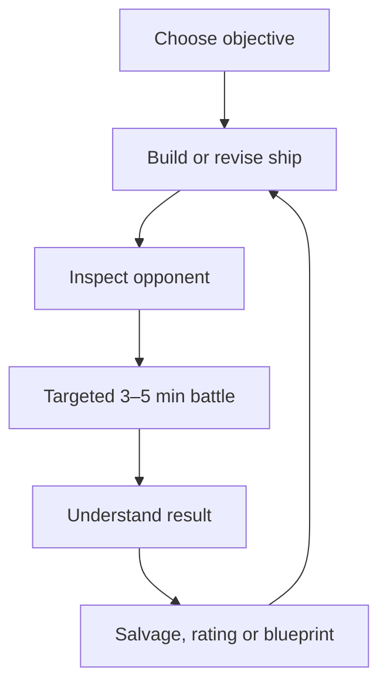

# Cosmic Fight — Gameplay 2.0

## Core promise

Build a ship with real engineering trade-offs, identify the enemy's critical dependency and disable it before the enemy dismantles yours.

The game is not about reducing a generic health bar. It is about taking away combat capability through visible systems.

## Primary loop

Every return to the builder should answer a battle lesson: improve protection, change energy allocation, add a counter-system or accept a different weakness.

## Player decisions

### Before battle

- choose a hull and its hardpoint topology;
- fit weapons, defenses and utility modules;
- stay within grid, mass, energy and heat limits;
- create protection and power routes;
- save an identifiable build;
- in modes that allow scouting, inspect the opponent and choose a plan.

### During battle

- choose one action;
- choose a target when the action requires it;
- decide between immediate damage, system denial, defense and recovery;
- manage energy, heat, cooldowns, ammunition and repair capacity;
- react to exposed modules and broken power paths.

### After battle

- see the exact defeat/victory reason;
- review decisive system events;
- receive rewards once;
- rematch, revise the build or continue the route.

## Match format

| Rule | Target |
|---|---|
| Structure | alternating authoritative turns |
| Normal duration | 3–5 minutes |
| Normal turn count | 8–14 total turns |
| Hard turn cap | defined per mode; timeout cannot leave a match active forever |
| Turn action | one attack, defense, scan, power redirect or repair action |
| Result | combat capability loss, structural collapse, surrender or timeout |
| Recovery | reconnect to the same persisted battle state |

## Ship construction

### Hulls

A hull defines:

- grid shape;
- module and weapon hardpoints;
- base integrity;
- maximum mass;
- reactor capacity;
- cooling capacity;
- base evasion;
- armor arcs;
- one identity bonus and one clear limitation.

Initial hulls are Scout, Vanguard and Bastion. They are sidegrades, not sequential tiers.

### Module placement

Free-position dragging is replaced by grid placement. A module has:

- footprint;
- type and compatible hardpoint rules;
- mass;
- energy draw or generation;
- heat generation or cooling;
- HP and local armor relation;
- power/data connection points;
- optional adjacency effect.

Placement is authoritative: the client previews legality, while the server validates and stores the final build.

### Readable topology

Power links are shown as functional paths. Destroying a bridge module may disconnect a healthy weapon. Armor protects a defined local region. The combat view uses the same topology as the builder so the player can predict consequences.

## Core systems

| System | Combat value | Failure consequence |
|---|---|---|
| Reactor/Core | supplies energy and anchors power graph | connected systems lose power; core collapse can end battle |
| Hull/Structure | keeps ship combat-capable | structural collapse ends battle |
| Engines | evasion and maneuver support | lower evasion and targeting stability |
| Sensors | target lock and scan quality | lower accuracy and incomplete enemy information |
| Weapon mount | enables equipped weapon actions | weapon unavailable |
| Armor | absorbs local incoming damage | protected systems become exposed |
| Cooling | removes heat | overheated systems throttle or go offline |
| Utility | shields, drones, repair or electronic warfare | associated action unavailable |

## Resources

### Energy

- generated at the start of a turn from powered reactor systems;
- spent by weapons and active systems;
- unused energy may be redirected or reserved only when a module/rule allows it;
- insufficient energy disables an action before target selection is committed.

### Heat

- generated by firing and selected utilities;
- removed by powered cooling at turn boundaries;
- high heat reduces efficiency;
- critical heat can force a module offline but must be forecast before confirmation.

### Ammunition

Used only where limited shots create identity, such as missiles and drones. Energy weapons rely primarily on power, heat and cooldowns.

### Repair kits

- repair is an action, not a passive reset;
- status removal and HP restoration have explicit costs;
- reviving a destroyed module costs more than stabilizing a damaged one;
- critical structural destruction may be non-repairable in competitive modes if needed for match length.

## Actions

### Fire

Choose an equipped, powered, ready weapon and a legal enemy module. The UI previews:

- hit chance band;
- energy and heat cost;
- armor interception;
- expected primary effect;
- cooldown or ammunition impact.

Exact hidden RNG is resolved by the server.

### Defend

Spend the turn to reduce incoming damage or reinforce a local armor arc until the next turn. This is a readable counter to telegraphed burst damage, not a generic permanent buff.

### Scan

Reveal concealed module state, weapon readiness or power routing. Sensors improve scan quality and resistance to electronic disruption.

### Redirect Power

Temporarily prioritize weapons, engines, shields or cooling. The benefit must create an opposing weakness so the action is a tactical trade-off.

### Emergency Repair

Restore HP, extinguish Fire, clear Electrical Short or revive a recoverable critical module. The target and kit cost are confirmed before spending the turn.

## Weapons and counters

| System | Identity | Strong against | Main constraint/counter |
|---|---|---|---|
| Laser | precise, efficient direct fire | exposed critical modules | armor and reduced sensor lock |
| Missile | burst, splash, fire pressure | clustered systems | ammunition, interception, evasion |
| Scatter | reliable close-pattern kinetic hit | armor stripping and fragile groups | weaker focused damage |
| Plasma | heavy energy bolt and short chance | powered electronics | heat, cooldown, shielding |
| Railgun | armor penetration and linear force | protected structural targets | high energy, telegraph, cooldown |
| EMP | low HP damage, strong disable | weapons, sensors and utilities | short duration, hardened circuits |
| Drone | persistent pressure and flexible target | exposed support systems | ammunition, anti-drone defense |
| Ion | drains or blocks energy | reactor-dependent builds | modest structural damage |

Two additional systems may be selected after playtests: defensive pulse, repair beam, mine layer or shield projector. Additions require a distinct decision and counter, not merely different numbers.

## Status effects

### Fire

- damages a module at a predictable turn boundary;
- creates visible flame/smoke and a remaining-turn indicator;
- can spread only if the rule is visible and bounded;
- can be removed by repair or a dedicated suppression system.

### Electrical Short

- disables or degrades an electronic module for a shown duration;
- does not silently consume an action;
- hardened circuits reduce chance or duration.

### Offline

A module can retain HP but lose power or be forced offline by heat. The UI must distinguish `destroyed`, `disconnected`, `shorted` and `overheated`.

## Victory and defeat

A battle ends with one structured reason:

| Reason | Rule |
|---|---|
| `core_collapse` | required core is destroyed and cannot recover under mode rules |
| `structural_collapse` | required hull/structure is destroyed |
| `combat_disabled` | no functioning attack and no legal recovery path remain |
| `integrity_failure` | integrity crosses the mode's terminal threshold |
| `surrender` | player concedes |
| `turn_timeout` | configured turn or match deadline expires |
| `disconnect_forfeit` | reconnect grace period expires |

The result screen names the reason in player language, highlights the decisive module chain and shows rewards/rating separately. Integrity percentage alone must never imply a contradictory result.

## Battle pacing

Target tuning:

- first meaningful system damage by turns 2–3;
- armor normally breaks after one focused sequence, not a long health tax;
- recovery buys a tactical window but cannot reset the full fight repeatedly;
- a strong counterplay can reverse momentum;
- hard cap prevents 20–30 turn attrition;
- animation is fast enough that information, not waiting, consumes most of the match time.

Balance telemetry should track median turns, real duration, action mix, target mix, first module destroyed, surrender rate and win rate by hull/build archetype.

## AI design

AI selects a plan, not a random valid target.

| Archetype | Behavior |
|---|---|
| Sniper | scans, removes armor, then focuses core/sensors |
| Missile hunter | pressures clustered systems and fire management |
| Tank | absorbs burst, repairs selectively and wins by efficiency |
| Saboteur | disables power, weapons and sensors before structural damage |
| Mechanic | preserves a fragile high-output build through recovery timing |

AI difficulty changes planning horizon, target evaluation and willingness to take risks. It must not gain hidden damage or accuracy bonuses without explicit mode modifiers.

## Solo campaign

The campaign is a route through three sectors. A node can be:

- combat;
- elite combat;
- commander/boss;
- repair dock;
- salvage/store;
- event with an informed risk/reward choice.

Persistent run state includes route, ship damage where the mode uses it, inventory, blueprints, currency and seed. Bosses alter rules or topology and test a learned mechanic.

## Multiplayer rules

- all combat resolution is server-authoritative;
- clients send intent with battle ID, turn and unique action ID;
- persisted battle state restores after deployment;
- result settlement is idempotent and atomic;
- Quick Match and Ranked use compatible build/mode versions;
- Ranked normalizes direct permanent power;
- reconnect grace, turn timer and forfeit are visible before they matter;
- rematch creates a new battle ID and requires both players to accept.

## Progression philosophy

Progression should widen the player's vocabulary:

- new hull topology;
- new weapon or utility sidegrade;
- alternative module behavior;
- cosmetic identity;
- new solo routes and challenges.

It should not create a permanently stronger veteran ship that a new ranked player cannot realistically beat.

## Interface direction

### Product UI lane

The primary task is rapid, confident decision-making. Cinematic effects support targeting and system failure but never cover controls or replace labels.

### Visual thesis

**Nebula Foundry:** industrial darkness, cold cyan navigation light, warm threat accents and high-contrast functional modules. The ship is the dominant object; UI chrome is restrained.

### Signature interaction

The same modular topology is readable in builder and battle. Damage progressively changes that topology: armor cracks, power links extinguish, modules spark and the final destruction follows the damaged chain.

### Information hierarchy

1. current turn and whose action it is;
2. own available actions/resources;
3. legal target and predicted consequence;
4. ship system state;
5. combat log and secondary details.

### Mobile layouts

**Portrait:** enemy ship upper field, own ship middle field, sticky bottom action tray, expandable tactical log.

**Landscape:** two ships side-by-side, system HUD at edges, action tray centered along the bottom.

Both orientations use 44 px minimum touch targets, safe-area insets and explicit selected/disabled states. Rotation preserves the current action and target.

### Motion and fallback

- 120–200 ms micro-feedback; 180–260 ms state transitions;
- projectile timing explains weapon identity but never blocks the next valid state longer than necessary;
- one authored destruction sequence is the main spectacle;
- reduced-motion uses short fades, static damage frames and no shake;
- low-quality mode reduces particles, blur and debris while preserving all state cues;
- hidden/offscreen continuous animation stops.

## Technical invariants

- server owns legality, RNG, damage, state transitions, winner and rewards;
- battle contracts are versioned;
- content and balance values become data-driven;
- active competitive state is persisted;
- actions are idempotent;
- the engine supports deterministic tests/replays;
- Web and Android do not duplicate authoritative rules;
- telemetry uses stable reason/action identifiers, not parsed log text.

## Version 1.0 definition of done

The game is complete enough for version 1.0 when a new player can:

1. finish onboarding;
2. build a legal ship with meaningful trade-offs;
3. complete a multi-sector solo campaign;
4. understand and counter several enemy archetypes;
5. play reliable Quick, Ranked and private PvP;
6. reconnect and review match history;
7. progress through sidegrades and cosmetics;
8. continue the same account on Web and Android;
9. experience complete audio, VFX, accessibility and mobile layouts.
